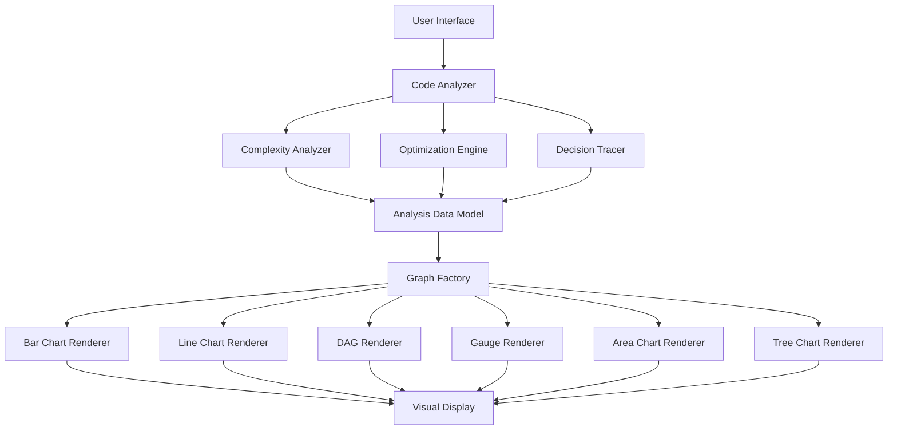

# Design Document: Visual Intelligence Graphs

## Overview

This design extends Code Lens AI with advanced graph-based visualization capabilities that transform abstract complexity analysis into intuitive, interactive visual representations. The system will provide 15 distinct visualization types including complexity breakdowns, growth curves, decision traces, and optimization comparisons.

The design follows a modular architecture where analysis engines generate data models, and specialized graph renderers transform these models into interactive visualizations using Recharts (a React-native charting library built on D3). All visualizations will be responsive, interactive, and designed for both learning and professional use cases.

## Architecture

### High-Level Architecture



### Component Layers

1. **Analysis Layer**: Extends existing Gemini-based analysis with structured data extraction
2. **Data Model Layer**: Strongly-typed TypeScript interfaces for all visualization data
3. **Rendering Layer**: Recharts-based components for each visualization type
4. **Interaction Layer**: Hover states, click handlers, and animation controllers

## Components and Interfaces

### 1. Extended Analysis Types

```typescript
// Extends existing CodeAnalysis interface
export interface ComplexityBreakdown {
  blocks: ComplexityBlock[];
  dominantBottleneck: string;
}

export interface ComplexityBlock {
  id: string;
  codeSnippet: string;
  lineRange: { start: number; end: number };
  complexity: string; // e.g., "O(n²)"
  contributionPercentage: number;
  type: 'loop' | 'recursion' | 'nested-loop' | 'sort' | 'search';
}

export interface GrowthCurveData {
  current: DataPoint[];
  optimized?: DataPoint[];
  scalingType: 'linear' | 'logarithmic' | 'polynomial' | 'exponential';
}

export interface DataPoint {
  inputSize: number;
  estimatedTime: number; // milliseconds
}

export interface OptimizationComparison {
  original: ComplexityMetrics;
  optimized: ComplexityMetrics;
  improvement: ImprovementMetrics;
}

export interface ComplexityMetrics {
  timeComplexity: string;
  spaceComplexity: string;
  timeComplexityNumeric: number; // for comparison
  spaceComplexityNumeric: number;
}

export interface ImprovementMetrics {
  timeImprovement: number; // percentage
  spaceImprovement: number; // percentage
  magnitude: 'significant' | 'moderate' | 'minimal';
}

export interface DecisionTrace {
  nodes: DecisionNode[];
  edges: DecisionEdge[];
}

export interface DecisionNode {
  id: string;
  label: string;
  type: 'pattern' | 'analysis' | 'conclusion';
  pattern?: 'loop' | 'recursion' | 'sort' | 'data-structure';
  details: string;
}

export interface DecisionEdge {
  from: string;
  to: string;
  reasoning: string;
}

export interface PerformanceRisk {
  score: number; // 0-100
  components: RiskComponents;
  zone: 'green' | 'yellow' | 'red';
}

export interface RiskComponents {
  timeComplexity: number; // weighted score
  spaceComplexity: number;
  inputSensitivity: number;
  codeSmells: number;
}

export interface InputSensitivity {
  bestCase: DataPoint[];
  averageCase: DataPoint[];
  worstCase: DataPoint[];
  sensitivityGap: number; // percentage difference
}

export interface CodeSmellMap {
  smells: CodeSmell[];
  connections: SmellConnection[];
}

export interface CodeSmell {
  id: string;
  type: string;
  lineRange: { start: number; end: number };
  severity: 'low' | 'medium' | 'high';
}

export interface SmellConnection {
  smellId: string;
  consequence: string;
  impactArea: 'cpu' | 'memory' | 'battery' | 'network';
}

export interface OptimizationTree {
  root: OptimizationNode;
  branches: OptimizationNode[];
}

export interface OptimizationNode {
  id: string;
  label: string;
  type: 'current' | 'time-optimized' | 'memory-optimized' | 'readable' | 'do-nothing';
  code: string;
  metrics: ComplexityMetrics;
  tradeoffs: string[];
}

export interface MemoryFootprint {
  categories: MemoryCategory[];
  totalByInputSize: DataPoint[];
}

export interface MemoryCategory {
  name: 'variables' | 'data-structures' | 'temporary';
  allocations: MemoryAllocation[];
}

export interface MemoryAllocation {
  name: string;
  sizeByInput: DataPoint[];
  color: string;
}

export interface AlgorithmIdentity {
  algorithmName: string;
  confidence: number; // 0-100
  category: 'sorting' | 'searching' | 'dynamic-programming' | 'graph' | 'unknown';
}

export interface RefactorImpact {
  current: DataPoint[];
  projected: DataPoint[];
  improvementPercentage: number;
  worthwhile: boolean;
}

export interface ScalabilityThreshold {
  maxInputSize: number;
  failureReason: 'timeout' | 'memory' | 'none';
  timeoutLimit: number; // seconds
  memoryLimit: number; // MB
}

export interface StabilityAssessment {
  performanceGain: number;
  stabilityRisk: number; // 0-100
  riskLevel: 'low' | 'moderate' | 'high';
  warnings: string[];
}

export interface LearningProgress {
  analyses: HistoricalAnalysis[];
  statistics: ProgressStatistics;
}

export interface HistoricalAnalysis {
  timestamp: number;
  riskScore: number;
  complexity: string;
  smellCount: number;
}

export interface ProgressStatistics {
  totalAnalyses: number;
  averageRiskScore: number;
  improvementPercentage: number;
  trendDirection: 'improving' | 'stable' | 'declining';
}

// Main extended analysis interface
export interface ExtendedCodeAnalysis extends CodeAnalysis {
  complexityBreakdown: ComplexityBreakdown;
  growthCurve: GrowthCurveData;
  optimizationComparison?: OptimizationComparison;
  decisionTrace: DecisionTrace;
  performanceRisk: PerformanceRisk;
  inputSensitivity: InputSensitivity;
  codeSmellMap: CodeSmellMap;
  optimizationTree: OptimizationTree;
  memoryFootprint: MemoryFootprint;
  algorithmIdentity: AlgorithmIdentity;
  refactorImpact?: RefactorImpact;
  scalabilityThreshold: ScalabilityThreshold;
  stabilityAssessment?: StabilityAssessment;
}
```

### 2. Analysis Engine Extensions

The existing `geminiService.ts` will be extended to request structured data for all visualization types. The Gemini API will be prompted to analyze code and return JSON matching the extended interfaces.

```typescript
// Extended prompt structure
const extendedPrompt = `
Analyze the following code and provide comprehensive analysis including:
1. Complexity breakdown with line-by-line contributions
2. Growth curve data points (n=1 to n=10000)
3. Decision trace showing reasoning steps
4. Performance risk score calculation
5. Input sensitivity analysis (best/average/worst cases)
6. Code smell detection and impact mapping
7. Multiple optimization alternatives
8. Memory footprint analysis
9. Algorithm pattern identification
10. Scalability threshold estimation

Code:
\`\`\`
${code}
\`\`\`
`;
```

### 3. Graph Renderer Components

Each visualization type will have a dedicated React component using Recharts:

#### ComplexityBreakdownChart
- **Type**: Horizontal Bar Chart
- **Data**: ComplexityBlock[]
- **Features**: Hover tooltips, dominant bottleneck highlighting
- **Library**: Recharts BarChart

#### GrowthCurveChart
- **Type**: Line Chart
- **Data**: GrowthCurveData
- **Features**: Dual lines (current/optimized), logarithmic scaling option, hover crosshair
- **Library**: Recharts LineChart with ResponsiveContainer

#### OptimizationComparisonChart
- **Type**: Grouped Bar Chart
- **Data**: OptimizationComparison
- **Features**: Side-by-side bars, percentage labels, color-coded improvements
- **Library**: Recharts BarChart

#### DecisionTraceGraph
- **Type**: Directed Acyclic Graph (DAG)
- **Data**: DecisionTrace
- **Features**: Interactive nodes, edge labels, click-to-expand details
- **Library**: Custom SVG with D3 force layout (Recharts doesn't support DAG)

#### PerformanceRiskGauge
- **Type**: Radial Gauge
- **Data**: PerformanceRisk
- **Features**: Color zones, animated needle, component breakdown on hover
- **Library**: Recharts RadialBarChart

#### InputSensitivityChart
- **Type**: Multi-line Chart
- **Data**: InputSensitivity
- **Features**: Three distinct lines, different styles (solid/dashed/dotted), legend
- **Library**: Recharts LineChart

#### CodeSmellMapGraph
- **Type**: Node-Link Diagram
- **Data**: CodeSmellMap
- **Features**: Click to highlight code, severity-based sizing, impact area colors
- **Library**: Custom SVG with D3 force simulation

#### OptimizationTreeChart
- **Type**: Tree Diagram
- **Data**: OptimizationTree
- **Features**: Expandable branches, metrics on hover, click to view code
- **Library**: Recharts TreeMap or custom SVG

#### MemoryFootprintChart
- **Type**: Stacked Area Chart
- **Data**: MemoryFootprint
- **Features**: Category colors, hover for specific allocations, smooth curves
- **Library**: Recharts AreaChart

#### AlgorithmIdentityBar
- **Type**: Horizontal Progress Bar
- **Data**: AlgorithmIdentity
- **Features**: Confidence percentage, algorithm name label, category icon
- **Library**: Custom styled div with CSS animations

#### RefactorImpactChart
- **Type**: Comparison Line Chart
- **Data**: RefactorImpact
- **Features**: Solid vs dashed lines, improvement annotation, worthwhile indicator
- **Library**: Recharts LineChart

#### ScalabilityThresholdChart
- **Type**: Line Chart with Vertical Marker
- **Data**: ScalabilityThreshold + GrowthCurveData
- **Features**: Threshold line, failure reason annotation, danger zone shading
- **Library**: Recharts LineChart with ReferenceLine

#### StabilityMeterChart
- **Type**: Balance Scale Visualization
- **Data**: StabilityAssessment
- **Features**: Two-sided scale, warning indicators, risk level badge
- **Library**: Custom SVG

#### LearningProgressChart
- **Type**: Trend Line Chart
- **Data**: LearningProgress
- **Features**: Time-series data, trend line, statistics panel
- **Library**: Recharts LineChart with Trend component

## Data Models

All data models are defined in the TypeScript interfaces above. Key design decisions:

1. **Numeric Complexity Mapping**: Convert Big-O notation to numeric values for comparison
   - O(1) = 1
   - O(log n) = 2
   - O(n) = 3
   - O(n log n) = 4
   - O(n²) = 5
   - O(n³) = 6
   - O(2ⁿ) = 7
   - O(n!) = 8

2. **Risk Score Calculation**:
   ```
   score = (timeComplexity * 0.4) + (spaceComplexity * 0.25) + 
           (inputSensitivity * 0.2) + (codeSmells * 0.15)
   ```

3. **Growth Curve Simulation**: Use complexity class to estimate runtime
   ```
   estimatedTime(n) = baseTime * complexityFunction(n)
   ```

4. **Memory Estimation**: Track allocations by category and scale with input size

## Correctness Properties

*A property is a characteristic or behavior that should hold true across all valid executions of a system—essentially, a formal statement about what the system should do. Properties serve as the bridge between human-readable specifications and machine-verifiable correctness guarantees.*


### Property 1: Contribution Percentages Sum to 100
*For any* set of complexity blocks identified by the analyzer, the sum of all contribution percentages should equal 100%.
**Validates: Requirements 1.2**

### Property 2: Complexity Breakdown Rendering Completeness
*For any* complexity breakdown data, the rendered chart should contain bars for all blocks, highlight the dominant bottleneck, and display tooltips on hover with correct code snippets and percentages.
**Validates: Requirements 1.3, 1.4, 1.5**

### Property 3: Growth Curve Input Range
*For any* analyzed code, the generated growth curve data should contain data points for input sizes from n=1 to n=10000.
**Validates: Requirements 2.1**

### Property 4: Growth Curve Rendering Completeness
*For any* growth curve data, the rendered chart should display current curve, optimized curve (if present), correct axis labels, hover tooltips with exact values, and logarithmic scaling when growth is exponential.
**Validates: Requirements 2.2, 2.3, 2.4, 2.5**

### Property 5: Optimization Metrics Completeness
*For any* optimization comparison, both original and optimized versions should have valid time complexity and space complexity values.
**Validates: Requirements 3.1, 3.2**

### Property 6: Optimization Comparison Rendering
*For any* optimization comparison data, the rendered chart should display side-by-side bars for time and space, show percentage improvements, and use color coding based on improvement magnitude (green ≥20%, yellow 10-19%, gray <10%).
**Validates: Requirements 3.3, 3.4, 3.5**

### Property 7: Decision Trace Acyclicity
*For any* decision trace graph, the graph should be a directed acyclic graph (DAG) with no cycles.
**Validates: Requirements 4.3**

### Property 8: Decision Trace Connectivity
*For any* decision trace graph, all nodes except the root should have at least one incoming edge.
**Validates: Requirements 4.4**

### Property 9: Decision Trace Rendering Completeness
*For any* decision trace data, the rendered graph should display all nodes, all edges with reasoning labels, and show detailed information on node click.
**Validates: Requirements 4.3, 4.4, 4.5**

### Property 10: Risk Score Bounds and Calculation
*For any* analyzed code, the performance risk score should be between 0 and 100, and should equal (timeComplexity × 0.4) + (spaceComplexity × 0.25) + (inputSensitivity × 0.2) + (codeSmells × 0.15).
**Validates: Requirements 5.1, 5.4**

### Property 11: Risk Score Zone Mapping
*For any* risk score, the gauge should display green zone for scores 0-40, yellow zone for 41-70, and red zone for 71-100.
**Validates: Requirements 5.2**

### Property 12: Input Sensitivity Case Completeness
*For any* analyzed code, the input sensitivity analysis should contain three distinct cases: best-case, average-case, and worst-case, each with performance data across multiple input sizes.
**Validates: Requirements 6.1, 6.2**

### Property 13: Sensitivity Gap Impact on Risk Score
*For any* input sensitivity analysis, when the gap between worst-case and best-case exceeds 50%, the input sensitivity component of the risk score should be increased.
**Validates: Requirements 6.4**

### Property 14: Sensitivity Chart Rendering
*For any* input sensitivity data, the rendered chart should display three distinct lines with correct styling (solid green for best, dashed blue for average, dotted red for worst).
**Validates: Requirements 6.3, 6.5**

### Property 15: Code Smell Consequence Mapping
*For any* detected code smell, there should be at least one associated consequence and impact area.
**Validates: Requirements 7.2**

### Property 16: Impact Area Categorization
*For any* code smell consequence, the impact area should be one of: CPU usage, memory usage, battery drain, or network overhead.
**Validates: Requirements 7.5**

### Property 17: Optimization Alternatives Minimum Count
*For any* analyzed code, the optimization engine should generate at least three alternatives: time-optimized, memory-optimized, and readability-focused.
**Validates: Requirements 8.1**

### Property 18: Optimization Alternative Metrics Completeness
*For any* optimization alternative, it should have complete complexity metrics (time and space) and a non-empty list of trade-offs.
**Validates: Requirements 8.2**

### Property 19: Do Nothing Option for Optimal Code
*For any* analyzed code with risk score below 30 and no significant optimizations available, the optimization tree should include a "do nothing" option.
**Validates: Requirements 8.5, 15.1, 15.2, 15.5**

### Property 20: Memory Category Completeness
*For any* memory footprint analysis, all memory allocations should be categorized as variables, data structures, or temporary storage.
**Validates: Requirements 9.1**

### Property 21: Memory Footprint Chart Rendering
*For any* memory footprint data, the rendered stacked area chart should use three distinct colors for the three categories and display allocation details on hover.
**Validates: Requirements 9.3, 9.4, 9.5**

### Property 22: Algorithm Confidence Bounds
*For any* algorithm identification, the confidence percentage should be between 0 and 100.
**Validates: Requirements 10.2**

### Property 23: Unknown Pattern Display Threshold
*For any* algorithm identification with confidence below 50%, the display should show "Unknown pattern" instead of a specific algorithm name.
**Validates: Requirements 10.4**

### Property 24: Refactor Impact Warning Threshold
*For any* optimization with projected improvement less than 10%, a warning about minimal impact should be displayed.
**Validates: Requirements 11.3**

### Property 25: Projected vs Actual Line Styling
*For any* refactor impact chart, projected curves should use dashed lines and actual curves should use solid lines.
**Validates: Requirements 11.5**

### Property 26: Scalability Threshold Default Constraints
*For any* scalability threshold estimation, the default timeout limit should be 30 seconds and the default memory limit should be 1GB (1024MB).
**Validates: Requirements 12.4**

### Property 27: Stability Risk Categorization
*For any* optimization alternative, the stability risk should be categorized as low (0-30%), moderate (31-60%), or high (61-100%).
**Validates: Requirements 13.4**

### Property 28: High Stability Risk Warning
*For any* optimization with stability risk exceeding 70%, a prominent warning should be displayed before allowing application.
**Validates: Requirements 13.5**

### Property 29: Analysis History Persistence Round Trip
*For any* code analysis, storing the results to local storage and then retrieving them should produce equivalent data.
**Validates: Requirements 14.1**

### Property 30: Analysis History Retention Limits
*For any* analysis history, the stored data should not exceed 100 analyses and should not include analyses older than 90 days.
**Validates: Requirements 14.4**

### Property 31: History Clear Completeness
*For any* user-initiated history clear operation, all analysis data should be removed from local storage.
**Validates: Requirements 14.5**

### Property 32: Progress Statistics Completeness
*For any* learning progress display, the statistics should include total analyses count, average risk score, and improvement percentage.
**Validates: Requirements 14.3**

### Property 33: Optimal Code Explanation Presence
*For any* "do nothing" recommendation, an explanation of why the code is already optimal should be provided.
**Validates: Requirements 15.4**

## Error Handling

### Analysis Errors
- **Gemini API Failures**: Retry with exponential backoff (3 attempts), then display user-friendly error
- **Invalid Code Input**: Detect syntax errors early and provide helpful messages
- **Timeout Errors**: Set 60-second timeout for Gemini requests, display timeout message

### Rendering Errors
- **Missing Data**: Gracefully handle missing optional fields, display "N/A" or hide sections
- **Invalid Data Ranges**: Validate numeric ranges before rendering, clamp to valid bounds
- **Chart Rendering Failures**: Catch Recharts errors, display fallback message

### Storage Errors
- **Local Storage Full**: Catch quota exceeded errors, prompt user to clear history
- **Storage Access Denied**: Handle private browsing mode, disable history features gracefully
- **Corrupted Data**: Validate stored data on retrieval, clear corrupted entries

### User Input Errors
- **Empty Code**: Disable analyze button when code is empty
- **Unsupported Languages**: Display warning for languages with limited analysis support
- **Very Large Code**: Warn users about potential slow analysis for code >10,000 lines

## Testing Strategy

### Dual Testing Approach

This project will use both **unit testing** and **property-based testing** to ensure comprehensive coverage:

- **Unit tests**: Verify specific examples, edge cases, and error conditions
- **Property tests**: Verify universal properties across all inputs
- Both approaches are complementary and necessary for complete validation

### Property-Based Testing with fast-check

We will use [fast-check](https://fast-check.dev/) as our property-based testing library for TypeScript. Fast-check is a mature, well-maintained library that generates random inputs to validate properties across hundreds of test cases.

**Configuration**:
- Minimum 100 iterations per property test
- Each property test must reference its design document property
- Tag format: `// Feature: visual-intelligence-graphs, Property N: [property text]`

**Example Property Test**:
```typescript
import fc from 'fast-check';

// Feature: visual-intelligence-graphs, Property 1: Contribution Percentages Sum to 100
test('complexity block contributions sum to 100%', () => {
  fc.assert(
    fc.property(
      fc.array(fc.record({
        id: fc.string(),
        contributionPercentage: fc.float({ min: 0, max: 100 })
      }), { minLength: 1 }),
      (blocks) => {
        const normalizedBlocks = normalizeContributions(blocks);
        const sum = normalizedBlocks.reduce((acc, b) => acc + b.contributionPercentage, 0);
        return Math.abs(sum - 100) < 0.01; // Allow floating point tolerance
      }
    ),
    { numRuns: 100 }
  );
});
```

### Unit Testing Focus Areas

Unit tests should focus on:

1. **Specific Examples**: Test known code patterns with expected outputs
2. **Edge Cases**: Empty arrays, single elements, boundary values
3. **Error Conditions**: Invalid inputs, API failures, storage errors
4. **Integration Points**: Component interactions, data flow between layers
5. **UI Interactions**: Click handlers, hover states, animations

**Example Unit Test**:
```typescript
test('displays "Unknown pattern" when confidence is below 50%', () => {
  const identity: AlgorithmIdentity = {
    algorithmName: 'Bubble Sort',
    confidence: 45,
    category: 'sorting'
  };
  
  const result = formatAlgorithmDisplay(identity);
  expect(result).toBe('Unknown pattern');
});
```

### Test Coverage Goals

- **Property Tests**: Cover all 33 correctness properties
- **Unit Tests**: Cover edge cases, error conditions, and specific examples
- **Integration Tests**: Test end-to-end flows from code input to visualization display
- **Visual Regression Tests**: Ensure charts render consistently (optional, using tools like Percy or Chromatic)

### Testing Tools

- **Test Runner**: Vitest (fast, Vite-native)
- **Property Testing**: fast-check
- **Component Testing**: React Testing Library
- **Mocking**: Vitest mocks for Gemini API
- **Coverage**: Vitest coverage with c8

### Continuous Testing

- Run tests on every commit (pre-commit hook)
- Run full test suite in CI/CD pipeline
- Maintain minimum 80% code coverage
- Property tests catch edge cases that unit tests miss
- Unit tests provide fast feedback for specific scenarios

## Implementation Notes

### Technology Stack
- **Frontend**: React 19 with TypeScript
- **Charting**: Recharts 2.x for most charts, custom D3 for DAG/tree visualizations
- **State Management**: React hooks (useState, useContext)
- **Storage**: Browser LocalStorage API
- **API**: Google Gemini AI (existing integration)
- **Testing**: Vitest + fast-check + React Testing Library
- **Build**: Vite

### Performance Considerations
- **Lazy Loading**: Load chart components only when needed
- **Memoization**: Use React.memo for expensive chart renders
- **Virtualization**: For large datasets (>1000 points), use data sampling
- **Debouncing**: Debounce hover events to prevent excessive re-renders
- **Web Workers**: Consider offloading complex calculations to workers

### Accessibility
- **Keyboard Navigation**: All interactive elements keyboard-accessible
- **Screen Readers**: Provide text alternatives for all visualizations
- **Color Contrast**: Ensure WCAG AA compliance for all color choices
- **Focus Indicators**: Clear focus states for all interactive elements
- **ARIA Labels**: Proper ARIA labels for charts and interactive elements

### Responsive Design
- **Mobile**: Stack visualizations vertically, simplify interactions
- **Tablet**: Two-column layout for most views
- **Desktop**: Full multi-column layout with side-by-side comparisons
- **Chart Responsiveness**: Use Recharts ResponsiveContainer for all charts

### Future Enhancements
- **Export**: Allow users to export charts as PNG/SVG
- **Sharing**: Generate shareable links for analyses
- **Comparison Mode**: Compare multiple code snippets side-by-side
- **Custom Thresholds**: Allow users to configure risk score thresholds
- **Dark Mode**: Add dark theme support for all visualizations
